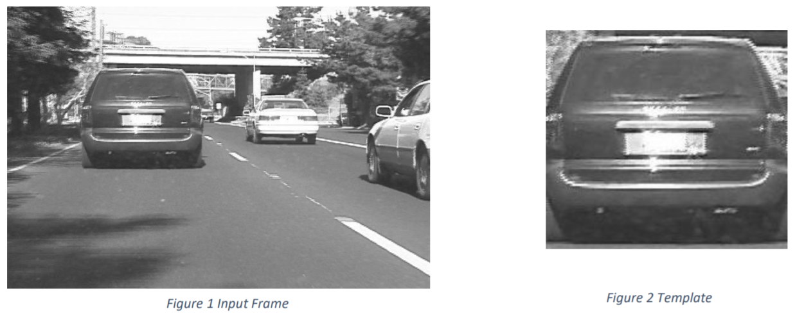
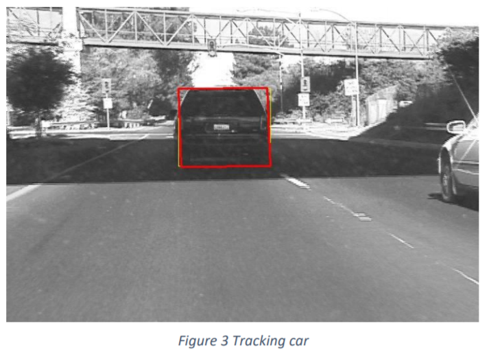
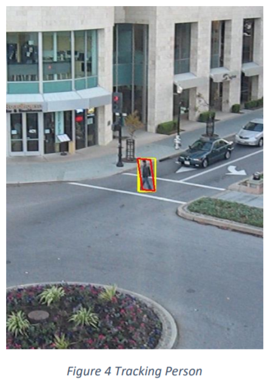
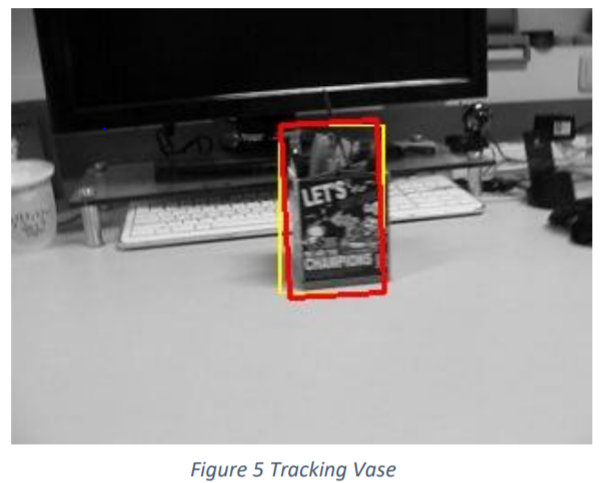
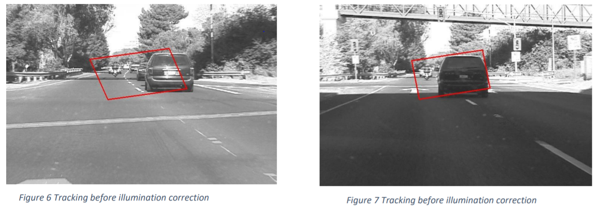
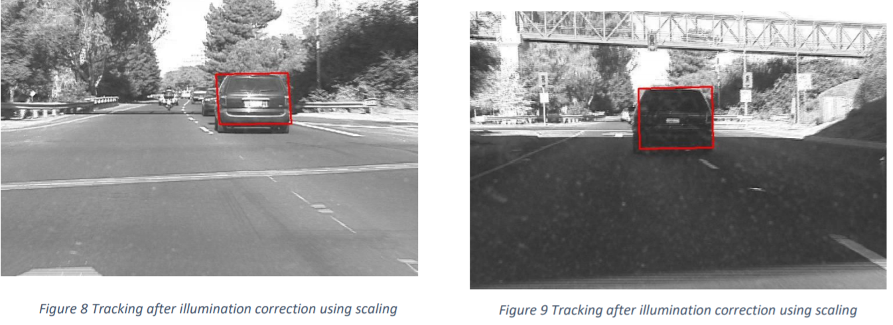
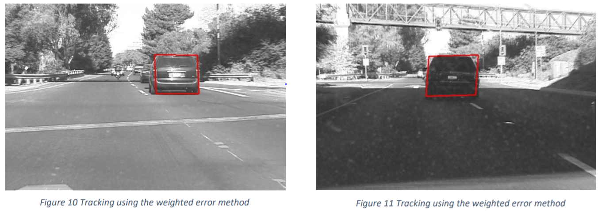

<h1 align=center> Lucas Kanade Tracker </h1>

## Overview
In this project we implemented the Lucas-Kanade (LK) template tracker. 
Here the code is evaluated on three video sequences from the Visual Tracker benchmark database: featuring a car on the road, a human
walking, and a vase on a table. 
To initialize the tracker we first need to define a template by drawing a bounding box around the object to be tracked in the first frame of the video. For each of the subsequent frames the tracker will update an
affine transform that warps the current frame so that the template in the first frame is aligned with the warped current frame.

## License
This project is under the [BSD License](https://github.com/krawal19/lucas_kanade_tracker/blob/master/LICENSE).

## Dependencies
The ARTag detection and Tracking package requires following dependencies.
- Numpy
- Python 3.5.4
- OpenCV 4.0.0 

## Operation
#### The pipeline for Lucas Kanade Template Tracker is as follows:
#### A) Implementation of the tracker
1. To initialize the template, we have used the mouse callback function wherein we can draw a box around the object of interest. The callback function gives the start and end coordinate of the rectangle.
2. We crop the image based on these coordinates from the first frame and use it as the template.

3. We  have  then read  all  the  images  from  the corresponding  folder  i.e.  car  or  human  or  vase  using  glob function.
4. We then store all the coordinates of the template in a matrix also store its intensitiesseparately.
5. Further, we start reading all the frames from the folder and scale its intensities based on the formula given in section 2.
6. Then we find the x and y gradientof the image using Sobel filter of kernel size 3.
7. We then calculate the affine matrix from the all the p values and warp the current image, and the gradientsusing itandcalculate the error between the warped current image and the template.
8. The matrix implementation we did earlier helps in expediating theprocessof warping.•We  then  find  the  Jacobian  and  multiply  it  with  the  gradients  obtained  above.  We  then  calculate  the steepest descent images and the hessian matrix using matrices which expediates the process.
9. Then  we  find  delta  p  usingthe formula given in the pdf and find its norm using the “np.linalg.norm” function.
10. In case of car if it  is less thanor equal to 0.035 then the we assume that the delta p has converged and move to next frame of repeat the process from affine matrix calculation.
11. If the iterations exceed 150 and the delta p has still not converged,then we simply assume that the delta p won’t converge and then use the last converged delta p and p matrix for further frame. 
12. We then find the bounding boxes of the tracking box using the 4 corners of the template. 
13. Following is the output of our LK algorithm tracking the objects. The red box is the final tracked box and theyellow box which changes is the combinations the algorithm tries to track the car.
14. Similar process is repeated for vase and human with different thresholds and iterations. Figure 1 Input Frame Figure 2 Template

15. In  the  data  frames  given  in  the  vase  detection,  the  change  of  the  object  position  in  between  two consecutive  frames  is  very  large.  This  cannot  be  compensated  by  the  basic  lucas-kanade  algorithm. Therefore, after some frames, the algorithm does not convergeto the minimum threshold. Thus,we have submitted the video submission till that frame.
16. Solution to this problem would be to use the pyramid method with the existing algorithm. By using down pyramid, we can reduce the resolution of the image and the change in position of the object to be tracked will be less at the top layer of the pyramid than the bottom layer. By computing the change in parameter thorough all such layers we can compensate the larger change in motion and detect the object.

#### B) Evaluation of the Tracker
1. During our implementation we found that for car and person we need tight bounding boxes because these objects are moving, and the changes in background creates noise. Hence, we want the least portion of the background.
2. In the case of vase since the object itself is not moving and the surrounding are pretty like the vase, thus, this strategy fails because the algorithm can’t distinguish well between the background and the object. Hence, in this case we select a bigger template so that it includes the background, which the algorithm can then use to detect changes.
3. The tracker fails when the object is moving at high speeds or there is change in illumination. In case of fast-movingobjects,the optical flow vector becomes too large in subsequent frames and hence the LK tracker can’t track it. In case of illumination changes the algorithm fails because the sum of squared distances error that it tries to minimize is sensitive to illumination changes.

#### Robustness to Illumination
#### A) Scaling of Intensities
1. To make our algorithm robust to illumination, we have calculated the mean of the template frame and the current frame.
2. We then use the following formula to get the intensities of the current frame.
FORMULA:

𝒇𝒓𝒂𝒎𝒆𝒄𝒖𝒓𝒓𝒆𝒏𝒕= (𝒎𝒆𝒂𝒏𝒐𝒇𝒕𝒆𝒎𝒑𝒍𝒂𝒕𝒆𝒊𝒏𝒕𝒆𝒏𝒔𝒊𝒕𝒊𝒆𝒔 /𝒎𝒆𝒂𝒏𝒐𝒇𝒕𝒉𝒆𝒄𝒖𝒓𝒓𝒆𝒏𝒕𝒇𝒓𝒂𝒎𝒆𝒊𝒏𝒕𝒆𝒏𝒔𝒊𝒕𝒊𝒆𝒔) ∗𝒇𝒓𝒂𝒎𝒆𝒄𝒖𝒓𝒓𝒆𝒏𝒕

3. In this case we thus scale the intensities of the current frame according to the template frame then pass toLK and the LK can now track the template. 

#### B) Weighted Error•
1. Here we will discussthe implementation of the second of illumination robustness.
2. Instead of giving same weightage to all the errors we gave weights to the errors by which the areas with more error willbe penalizedmore. •And thus, the effect of outliers in the output will greatly reduce.
3. We calculated the mean and variance of error and then if its in one standard deviation then itwas given a higher value andlower valuewas given to the outliers. 
4. Following is the output of this technique.
Formula:

𝛁𝒑=(𝑨𝑻⋀𝑨)−𝟏𝑨𝑻⋀𝒃

## Instructions
Download the dependencies.
- Open the code in an editoror terminal
- Run the codeor type python file.py in terminal. Here file = car, human, vase.
- The code will ask “Do you want to select the bounding box for template or use the tested bounding box for best results?”  
- Here put “y” for yes and “n” for no.
- If “y” is selected the code will pop a window. Press left mouse button at the top left corner of the car and leave it at the bottom right of the car.Then a white square will appear on thesame window showing the template you have selected. If you are happy with it then press ‘q’ two times for the tracking to start otherwise repeat the same dragging process.
- Note that the rectanglewon’t be displayed while the mouse left button is pressed.
- The code will now start to execute.•When the code stops running i.e. when last frame is reached, press ‘q’ to end the code
- The code will post output inoutput/carfolder and put the tracked images in it 
- If the code shows index error anytime while running the code, repeat the entire process with more constrained bounding box.

## Note
The above pipeline is developed specifically of the given videos under data folder and is not generalized.
We have provided following data
- car.py: Containscode for car trackingusing illumination scaling method
- human.py: Contains code for persontrackingusing illumination scaling method
- vase.py: Contains code for vasetrackingusing illumination scaling method
- weightedCar.py: Containscode for car trackingusing weighted method
- weightedHuman.py: Contains code for persontrackingusing method
- weightedVase.py: Contains code for vasetrackingusing method
- human folder: Input images for human 
- vase folder: Input images for vase•car folder: Input images for car
- output: folder containing outputwith scaling method
- weightedOutput: folder containing output of the codes withweighted me